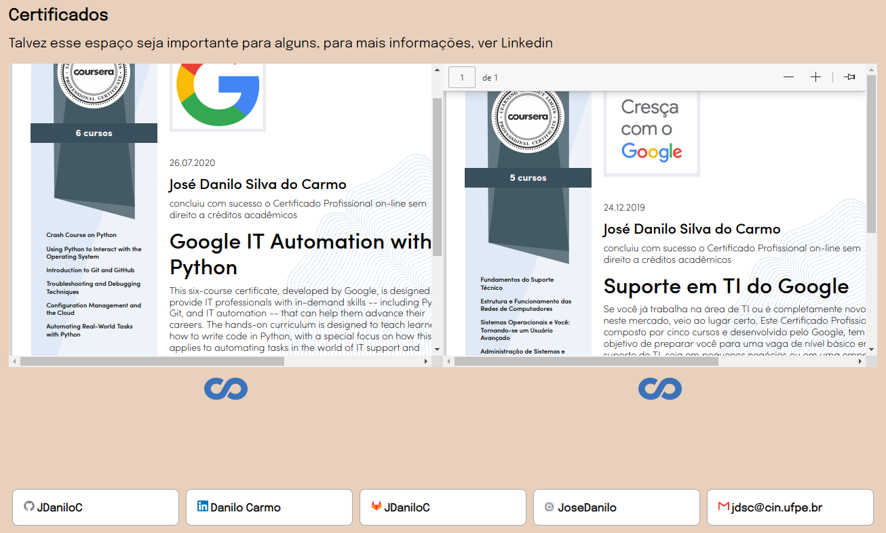

# Portifólio
Projeto para a cadeira IF668 - Introdução à computação

    <image src=".github/about.png">

## Objetivo
Demonstrar aptidáo em HTML/CSS e Javascript puro além do desenvolvimento de sites.

## HTML
Organização com as tags corretas como header, nav, footer. Aplicação correta das tags anchor (a) e divisão em parágrafos.

## CSS
Utilização de diversos tipos de display (flex, block, none), position (relative, fixed, absolute) entre outros estilos. Organização do HTML (como centralização e tamanho) através da estilização. Preocupação com a responsividade e animações para a visualização da página.

## Javascript
Criação de um script que interage com DOM e modifica a estilização, no qual forma uma visualização de sections no estilo album.

    <image src=".github/responsive.png">

